# PNG Optimizer

> Lossless PNG optimization for web/UI assets — resize once, compress hard, keep every pixel.

A small Python script that takes PNGs from a `source/` folder, downscales any oversized images (preserving aspect ratio), and runs them through a multi-stage **pixel-perfect lossless** compression pipeline. Output lands in `dist/` with original filenames.

No color quantization. No quality loss. Just smaller files.

---

## How it works

The optimizer is a **three-stage lossless pipeline**. Stage 1 only acts when the image exceeds the size cap, stage 2 always runs, stage 3 runs whenever an external tool is available.

```mermaid
flowchart LR
    Src[("source/<br/>*.png")] --> S1
    S1["Stage 1<br/>Resize<br/>(Pillow LANCZOS)"] --> S2
    S2["Stage 2<br/>Re-encode<br/>(Pillow optimize=True)"] --> S3
    S3["Stage 3<br/>Final squeeze<br/>(oxipng / optipng)"] --> Dst[("dist/<br/>*.png")]

    style S1 fill:#333,stroke:#1976d2
    style S2 fill:#333,stroke:#388e3c
    style S3 fill:#333,stroke:#f57c00
```



Zooming in on what happens to each individual file as it travels through the pipeline:

```mermaid
flowchart TD
    Start(["Process file: src_path"]) --> Stat["Read original size:<br/>orig_bytes = src_path.stat().st_size"]
    Stat --> Open["Image.open(src_path)"]

    Open --> ModeCheck{"img.mode == 'P'<br/>AND has<br/>transparency?"}
    ModeCheck -->|Yes| Convert["img.convert('RGBA')<br/>prevents alpha loss"]
    ModeCheck -->|No| Load
    Convert --> Load["img.load()<br/>force pixel decode"]

    Load --> Dims["Read w, h = img.size"]
    Dims --> SizeCheck{"max(w, h)<br/>&gt; max_dim?"}

    SizeCheck -->|No| Keep["Keep original<br/>was_resized = False"]
    SizeCheck -->|Yes| Scale["scale = max_dim / max(w, h)<br/>new_w = round(w * scale)<br/>new_h = round(h * scale)"]
    Scale --> Resize["img.resize((new_w, new_h),<br/>Image.LANCZOS)<br/>was_resized = True"]

    Keep --> Save
    Resize --> Save["out_img.save(dst_path,<br/>format='PNG',<br/>optimize=True)"]

    Save --> ToolCheck{"External tool<br/>configured?"}
    ToolCheck -->|No| Measure
    ToolCheck -->|Yes| RunTool["subprocess.run<br/>cmd, check=True,<br/>capture_output=True"]

    RunTool --> ToolOk{"Exit<br/>code 0?"}
    ToolOk -->|Yes| Measure
    ToolOk -->|No| WarnFail["Print warning to stderr<br/>file from stage 2 stays<br/>in dist/ as fallback"]
    WarnFail --> Measure

    Measure["final_bytes = dst_path.stat().st_size"]
    Measure --> Return(["Return:<br/>orig_bytes, final_bytes,<br/>was_resized"])

    style Start fill:#333,stroke:#1976d2
    style Return fill:#333,stroke:#2e7d32
    style WarnFail fill:#333,stroke:#f57c00
    style Convert fill:#333,stroke:#7b1fa2
    style Resize fill:#333,stroke:#0277bd
```



A few decisions worth highlighting in that flow:

- **Palette-mode conversion (purple node).** PNGs in mode `P` can store transparency in `info["transparency"]` rather than in an alpha channel — converting to `RGBA` first guarantees the alpha survives the round-trip.
- **LANCZOS resampling (blue node).** Highest-quality downscaling filter Pillow offers, sharper than bicubic on photos and UI text.
- **External-tool failure (orange node).** If `oxipng`/`optipng` exits non-zero, the script logs the error and keeps the file from stage 2. You always end up with a valid optimized PNG.

---

## Requirements

- Python 3.8+
- [Pillow](https://pillow.readthedocs.io/) (installed via `requirements.txt`)
- `oxipng` _or_ `optipng` — optional but recommended (~10–30% extra savings)

## Setup (Linux)

```bash
# 1. System tool — pick one. oxipng is faster and compresses better.
sudo apt update
sudo apt install oxipng        # preferred
# sudo apt install optipng     # fallback

# 2. Python deps
python3 -m venv .venv
source .venv/bin/activate
pip install -r requirements.txt
```

If neither `oxipng` nor `optipng` is installed, the script still works — it just skips stage 3 and prints the install command.

## Usage

Drop your PNGs into `source/`, then:

```bash
python3 optimize.py
```

Optimized files land in `dist/` with the same filenames.

### Options

```bash
python3 optimize.py --max-dim 1920          # cap longest side at 1920 px
python3 optimize.py --max-dim 0             # no resizing, compress only
python3 optimize.py --source ./in --dist ./out
python3 optimize.py --no-tool               # skip oxipng/optipng pass
python3 optimize.py --help
```

### Make targets

```bash
make install    # install Python deps
make optimize   # run with defaults
make clean      # empty dist/
```

## Output

Per-file before/after sizes, percent saved, and whether stage 1 actually downscaled:

```
File                                         Before      After    Saved  Resized
--------------------------------------------------------------------------------
hero-banner.png                              1.8 MB    412.3 KB    77.6%  yes
icon-cart.png                               12.4 KB      8.1 KB    34.7%  -
product-photo-01.png                         2.1 MB    498.7 KB    76.8%  yes
--------------------------------------------------------------------------------
TOTAL                                        3.9 MB    919.1 KB    77.0%
```

## Notes

- Non-PNG files in `source/` are skipped silently.
- Transparency (RGBA) is always preserved.
- Re-running on already-optimized files is safe (idempotent).
- The default size cap of **1280 px** on the longest side is tuned for web/UI assets. Override with `--max-dim` for other use cases.
